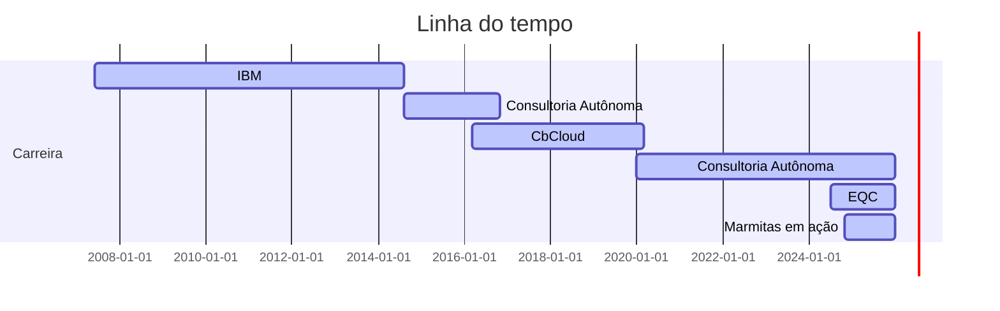

## > Hello World! 👋
### 🧩 Quem sou eu:
Meu nome é Paula, sou uma cientista de dados com sólida experiência em análise, negócios e programação. Trabalho com análise estatística de dados e desenvolvimento de modelos de machine learning em busca de insights valiosos que facilitam a tomada de decisão. Minha atuação destaca-se na entrega centrada na percepção de valor do negócio. 

### 🎯 Meus objetivos:
Sonho em me especializar em estatística e machine learning, me tornar referência como Cientista de Dados e proporcionar uma vida melhor para minha família.

### 🔎 O que procuro:
Busco novos desafios como Cientista de Dados em empresas que utilizem dados com propósito, transformando-os em soluções que façam a diferença no negócio e na vida das pessoas.

## 📽 Minha trajetória
Aproveite para conhecer um pouco mais da minha trajetória.

## 📫 Vamos nos conectar?
Você pode me encontrar nos links abaixo. Sinta-se a vontade para entrar em contato.
  

&nbsp;

&nbsp;

&nbsp;

## 💡 Curiosidades sobre mim:

- 🖥️ Programo desde 1996, aos 13 anos;
- 💍 Sou casada desde 2019; 🏳‍🌈
- 🐺 Sou mãe de 4 pets; (rsrs)
- 🌎 Amo viajar e conhecer novas culturas;
- 📈 Invisto desde 2009;
- 🧠 Trabalhei alguns anos com Poker e Mercado Financeiro;
- 🥁 Toco bateria; 🤘
- 🧉 AMO mate (meu segredo para voltar com tudo depois do almoço).
