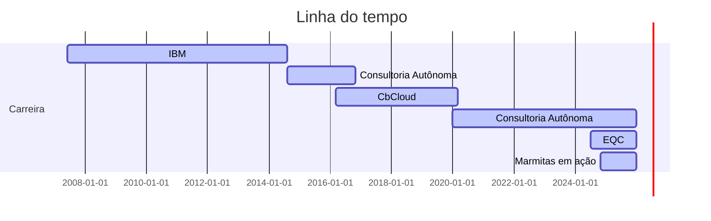

## > Hello World! 👋
### 🧩 Quem sou eu:

A Ciência de Dados não é só minha profissão, é a linguagem que satisfaz a minha criança interior. Seja na busca por padrões escondidos, conexões invisíveis ou **desvendando histórias por trás dos números**.

Minha formação me deu as ferramentas, mas meu diferencial está na forma como enxergo os dados: com o **olhar analítico** de Sherlock Holmes, a sede por desvendar mistérios de Miss Marple e a capacidade de ambos de transformar caos em clareza com método e criatividade.

Onde os dados ganham vida, é onde encontro minha vocação: nessa busca por significado.

### ✨ Por que faço o que faço?
Acredito em dados que servem às pessoas. Por trás de cada modelo que construo, há uma pergunta essencial: "Como isso transforma decisões — e vidas?".

Meu propósito é usar estatística e machine learning não como fins em si mesmos, mas como meios para criar impacto real, como pontes entre a complexidade e a ação. Seja otimizando um processo, revelando uma tendência oculta ou simplificando o complexo, busco entregar não só respostas, mas valor.

### 🎯 O que me move:
- **Resolver desafios** como quem monta um quebra-cabeças;
- **Traduzir o técnico em estratégia** — porque dados só criam impacto quando **compreendidos**;
- **Aprender sempre** — da matemática mais abstrata às riquezas da cultura humana (minha segunda paixão).

*"Dados são minha matéria-prima, mas a **humanidade** por trás deles é o que me inspira."*

## 📽 Minha trajetória:
Aproveite para conhecer um pouco mais da minha trajetória.

## 📫 Vamos nos conectar?
Você pode me encontrar nos links abaixo. Sinta-se a vontade para entrar em contato.
  

&nbsp;

&nbsp;

&nbsp;

## 💡 Curiosidades sobre mim:

- 🖥️ Programo desde 1996, aos 13 anos;
- 💍 Sou casada desde 2019; 🏳‍🌈
- 🐺 Sou mãe de 4 pets; (rsrs)
- 🌎 Amo viajar e conhecer novas culturas;
- 📈 Invisto desde 2009;
- 🧠 Trabalhei alguns anos com Poker e Mercado Financeiro;
- 🥁 Toco bateria; 🤘
- 🧉 AMO mate (meu segredo para voltar com tudo depois do almoço).
